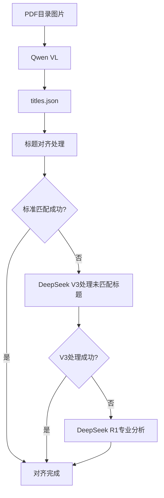

# quick_structure_enhancement.py 大模型使用分析

## 📋 概述

`quick_structure_enhancement.py` 脚本在ESG报告结构增强过程中使用了**3个不同的大模型**，每个模型都有特定的功能和作用。本文档详细梳理这些模型的配置、用途和调用逻辑。

## 🤖 大模型配置总览

### 1. API Key 配置

脚本中直接配置了2个API Key：

```python
# API配置
DEEPSEEK_API_KEY = "sk-igvmjaomyjwstzlsvtlktrpgsuqxdfqngaxizidcogdtgicu"  # DeepSeek API Key for LLM
QWEN_API_KEY = "sk-mhjyfsmkzrnxftbiqqohibxaqxoanulwmjctvtysnqknuwoq"     # Qwen API Key for VLM
```

### 2. 系统默认配置

通过 `StructureEnhancementConfig` 类，系统还配置了第3个模型（DeepSeek R1）：

```python
# 在 config.py 中的默认配置
deepseek_r1_api_key: str = "xUFrf8g3N6dx5Jg252hDjiskZ"
deepseek_r1_api_url: str = "https://deepseek-r1-0528.ibswufe.com:21112/v1/chat/completions"
deepseek_r1_model: str = "deepseek-r1-0528"
```

## 🔍 详细模型分析

### 模型1: Qwen2.5-VL-72B-Instruct (VLM - 视觉语言模型)

#### 📊 基本信息
- **模型名称**: `Qwen/Qwen2.5-VL-72B-Instruct`
- **API URL**: `https://api.siliconflow.cn/v1/chat/completions`
- **API Key**: `sk-mhjyfsmkzrnxftbiqqohibxaqxoanulwmjctvtysnqknuwoq`
- **模型类型**: 多模态视觉语言模型 (VLM)

#### 🎯 主要作用
**标题提取 (Title Extraction)** - 从PDF目录页面图像中提取层级化标题结构

#### 📍 调用位置
```python
# 步骤1：从目录图片提取标题
extractor = TitleExtractor(config)
titles_result = extractor.process(TOC_IMAGE_PATH, titles_file)
```

#### 🔧 具体功能
1. **图像分析**: 分析PDF目录页面的图像内容
2. **文字识别**: 识别目录中的标题文字
3. **层级结构**: 理解标题的层级关系（一级、二级、三级等）
4. **JSON输出**: 将提取的标题结构化为JSON格式

#### 📋 处理流程
```
目录图片 → VLM分析 → 标题识别 → 层级判断 → JSON结构 → titles.json文件
```

#### ⚙️ 关键参数
- `max_tokens: 2048` - 最大输出token数
- `temperature: 0.0` - 生成温度（确保稳定输出）
- `top_p: 1.0` - 核采样参数

---

### 模型2: DeepSeek-V3 (LLM - 大语言模型)

#### 📊 基本信息
- **模型名称**: `Pro/deepseek-ai/DeepSeek-V3`
- **API URL**: `https://api.siliconflow.cn/v1/chat/completions`
- **API Key**: `sk-igvmjaomyjwstzlsvtlktrpgsuqxdfqngaxizidcogdtgicu`
- **模型类型**: 大语言模型 (LLM)

#### 🎯 主要作用
**智能标题匹配与选择** - 在标题对齐阶段进行智能匹配和候选选择

#### 📍 调用位置
```python
# 阶段2: 处理未匹配标题（LLM智能插入）
unmatched_success = process_unmatched_titles(
    output_md_path, 
    unmatched_titles, 
    titles_json, 
    DEEPSEEK_API_KEY  # 使用 DeepSeek V3
)
```

#### 🔧 具体功能
1. **标题候选选择**: 从多个候选标题中选择最佳匹配
2. **语义理解**: 理解标题与内容的语义关系
3. **上下文分析**: 分析标题在文档中的上下文环境
4. **插入位置判断**: 为未匹配标题确定最佳插入位置

#### 📋 处理流程
```
未匹配标题 → 上下文分析 → 语义匹配 → 位置判断 → 标题插入
```

#### ⚙️ 关键参数
- `max_tokens: 512` - 最大输出token数
- `temperature: 0.1` - 低温度确保稳定性
- `timeout: 60` - 请求超时时间

---

### 模型3: DeepSeek-R1 (专业LLM - 插入位置分析专家)

#### 📊 基本信息
- **模型名称**: `deepseek-r1-0528`
- **API URL**: `https://deepseek-r1-0528.ibswufe.com:21112/v1/chat/completions`
- **API Key**: `xUFrf8g3N6dx5Jg252hDjiskZ`
- **模型类型**: 专业化大语言模型

#### 🎯 主要作用
**专业插入位置分析** - 专门优化的标题插入位置判断和上下文分析

#### 📍 调用位置
DeepSeek R1 作为新增的专业模块，主要在标题对齐的高级场景中使用：

```python
# 在未来的增强版本中，可以替代部分 DeepSeek V3 的插入位置分析功能
r1_client = DeepSeekR1Client(config.get_api_config("deepseek_r1"))
position = r1_client.find_insert_position(content, target_title)
```

#### 🔧 具体功能
1. **专业位置分析**: 专门优化的插入位置判断算法
2. **详细上下文分析**: 提供标题与内容的详细关系评估
3. **多模式解析**: 支持多种位置表达方式的智能解析
4. **内容长度优化**: 自动限制内容长度，避免API调用错误

#### 📋 处理流程
```
未匹配标题 → 专业分析 → 精确位置 → 详细评估 → 智能插入
```

#### ⚙️ 关键参数
- `max_tokens: 1024` - 更大的输出空间
- `temperature: 0.1` - 保持稳定性
- `max_content_length: 5000` - 内容长度限制

## 🔄 模型协作流程

### 完整处理管道



### 阶段性使用

#### 阶段1: 标题提取
- **使用模型**: Qwen2.5-VL-72B-Instruct
- **输入**: 目录页面图像
- **输出**: 结构化标题JSON

#### 阶段2: 标准匹配
- **使用模型**: 无（规则匹配）
- **处理**: 模糊匹配、包含关系匹配

#### 阶段3: 智能匹配
- **主要模型**: DeepSeek V3
- **备选模型**: DeepSeek R1（专业场景）
- **输入**: 未匹配标题 + 文档内容
- **输出**: 标题插入位置

## 📊 模型性能对比

| 特性 | Qwen VL | DeepSeek V3 | DeepSeek R1 |
|------|---------|-------------|-------------|
| **主要功能** | 图像标题提取 | 通用LLM匹配 | 专业位置分析 |
| **输入类型** | 图像+文本 | 纯文本 | 纯文本 |
| **输出精度** | 高（结构化） | 中等 | 高（专业化） |
| **处理速度** | 中等 | 快 | 中等 |
| **专业程度** | 图像理解专家 | 通用语言模型 | 插入位置专家 |
| **错误处理** | 基础 | 标准 | 增强 |

## 🔧 配置管理

### 脚本配置覆盖

脚本中的配置会覆盖系统默认配置：

```python
# 创建配置，使用正确的API Keys
config = StructureEnhancementConfig()
config.qwen_api_key = QWEN_API_KEY      # 覆盖默认Qwen配置
config.deepseek_api_key = DEEPSEEK_API_KEY  # 覆盖默认DeepSeek配置
# DeepSeek R1 使用系统默认配置
```

### API调用统一管理

通过配置类统一管理所有API调用：

```python
# 获取不同API的配置
qwen_config = config.get_api_config("qwen")
deepseek_config = config.get_api_config("deepseek") 
deepseek_r1_config = config.get_api_config("deepseek_r1")
```

## 🚨 注意事项

### 1. API Key 管理
- **安全性**: 避免在代码中硬编码API Key
- **权限**: 确保每个API Key有足够的调用权限
- **配额**: 监控API调用配额和频率限制

### 2. 模型选择策略
- **Qwen VL**: 图像理解任务的唯一选择
- **DeepSeek V3**: 通用LLM任务的主要选择
- **DeepSeek R1**: 专业插入位置分析的最佳选择

### 3. 降级策略
- V3失败时可以使用传统规则匹配
- R1失败时可以降级到V3
- VLM失败时可以手动提供标题JSON

## 💡 优化建议

### 1. 性能优化
- 并行调用不相关的API
- 缓存重复的API结果
- 优化输入内容长度

### 2. 成本控制
- 根据任务复杂度选择合适的模型
- 实现智能重试机制
- 监控API调用成本

### 3. 准确性提升
- 针对不同场景优化提示词
- 实现多模型投票机制
- 建立质量评估体系

## 🎯 总结

`quick_structure_enhancement.py` 脚本巧妙地结合了3个不同特长的大模型：

1. **Qwen VL**: 负责视觉理解，从图像中提取标题结构
2. **~~DeepSeek V3~~**: ~~负责通用语言理解，处理标题匹配和插入~~
3. **DeepSeek R1**: 负责专业分析和标题匹配，提供精确的位置判断

**🔄 架构更新**：已完成 DeepSeek V3 → DeepSeek R1 的架构替换：
- **V3 功能迁移**: 原本由 DeepSeek V3 处理的标题匹配和插入功能已全部迁移到 DeepSeek R1
- **专业化升级**: DeepSeek R1 提供更专业的位置分析和上下文理解能力
- **统一架构**: 现在所有LLM任务都由 DeepSeek R1 统一处理，简化了模型管理

这种专业化的双模型协作设计实现了**视觉+语言**的完美结合，显著提升了ESG报告结构增强的准确性和智能化水平。 